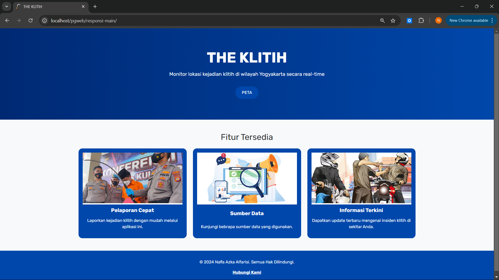
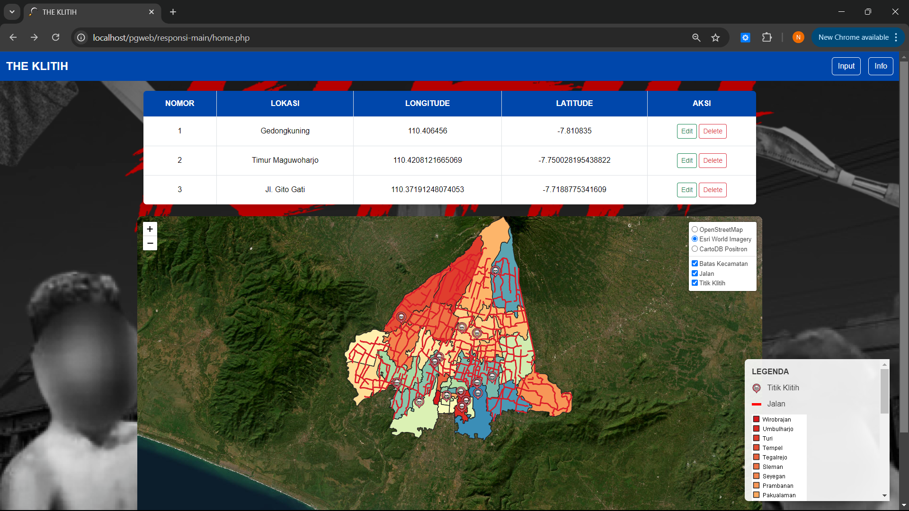
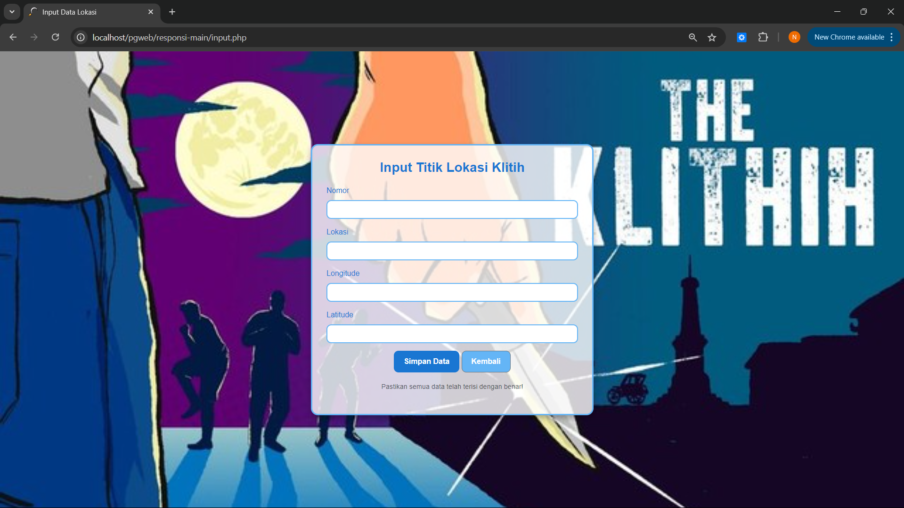

# The Klitih (Persebaran Titik Klitih)

## Deskripsi Produk
WebGIS ini dirancang untuk memvisualisasikan data persebaran titik-titik klitih di wilayah Yogyakarta. Klitih, sebagai fenomena tindak kejahatan jalanan, memerlukan perhatian khusus dari masyarakat dan pihak berwenang. Aplikasi ini bertujuan menyediakan informasi spasial yang akurat, interaktif, dan mudah diakses bagi pengguna dalam memahami sebaran kejadian klitih.

## Tujuan Produk
1. Menyediakan visualisasi peta interaktif untuk lokasi kejadian klitih.
2. Membantu masyarakat mengenali area rawan tindak kriminalitas jalanan.
3. Memberikan referensi bagi pihak berwenang untuk langkah pencegahan dan penanggulangan.

## Komponen Pembangun Produk
- **Data Spasial**: Data titik lokasi kejadian klitih diperoleh dari hasil pengumpulan manual serta sumber berita terpercaya.
- **GeoJSON**: Digunakan untuk menampilkan titik-titik lokasi kejadian klitih secara dinamis pada peta.
- **GeoServer**: Menyediakan data spasial batas administrasi berbasis layanan web (WMS/WMTS).
- **Bootstrap**: Digunakan untuk membuat tampilan layout yang modern dan responsif, sehingga website dapat diakses dengan baik di berbagai perangkat.

## Sumber Data
- [Geoportal Sleman](https://geoportal.slemankab.go.id/#/)
- [Harian Jogja](https://jogjapolitan.harianjogja.com/read/2023/02/18/510/1126656/7-kawasan-di-jogja-yang-pernah-terjadi-klitih-nomor-7-malah-di-pusat-keramaian)

## Tangkapan Layar Komponen Penting Produk
Berikut adalah beberapa tangkapan layar dari aplikasi WebGIS:

1. **Tampilan Utama**  
   

2. **Peta Persebaran Titik Klitih**  
   

3. **Pengisian Data Titik Klitih**  
   

## LINK WEBSITE
Aplikasi ini dapat diakses melalui link berikut:  
👉 **[The Klitih WebGIS](https://nafis0403.github.io/responsi_pgweb/)**  
